# FourPillars

> 메인화면

<p align="center">
  
  
  
  
  
</p>

## 1. 프로젝트 소개

FourPillars는 사용자의 생년월일시로 사주를 계산하고, 그 결과를 오늘의 운세·학과 추천·학업운·팀플 궁합 기능에 활용하는 웹 애플리케이션입니다.

백엔드에서 사주 원국, 오행, 십성, 신살, 용신과 대운을 직접 계산하며 외부 사주 계산 API를 사용하지 않습니다. 프론트엔드는 계산 결과를 점수, 그래프, 추천 목록과 설명 형태로 제공합니다.

> 사주·운세·타로 결과는 탐색과 오락을 위한 참고 정보이며, 진로 적합도·합격 가능성 또는 전문 상담을 대신하지 않습니다.

### 핵심 구현 범위

| 영역 | 구현 내용 |
| --- | --- |
| 계정과 프로필 | 단계형 회원가입, JWT 로그인, 출생일·출생시·양력/음력·성별 저장 |
| 사주 계산 | 연·월·일·시주, 오행, 십성, 지장간, 십이운성, 공망, 신살, 용신, 대운 |
| 오늘의 운세 | 6개 영역 점수, 연간 순위, 최근 7일 추이, 운세 확인 기록 캘린더 |
| 학과 추천 | 사주 성향을 8대 전공 적성으로 변환하고 인하공전 33개 학과 중 TOP 3 추천 |
| 학업운 | 78장 타로에서 하루 한 장을 뽑아 조언·주의점·실천 미션 제공 |
| 팀플 궁합 | 2~5명의 사주를 비교해 팀 점수, 개인 역할, 팀원별 궁합 제공 |

---

## 2. 사용자 흐름

### 2.1 단계형 온보딩

긴 가입 폼 대신 한 화면에 한 질문만 보여 줍니다. 이름과 계정을 만든 뒤 생년월일시, 양력·음력, 성별을 순서대로 입력하며 이 정보가 이후 모든 개인화 계산의 기준이 됩니다.

<table>
  <tr>
    <td align="center">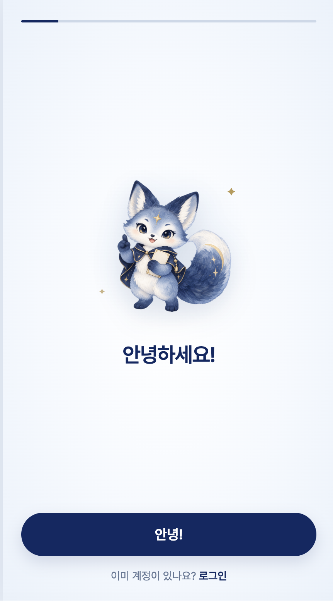<br /><sub>시작 화면</sub></td>
    <td align="center">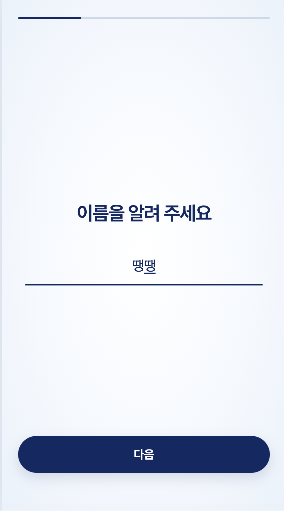<br /><sub>이름 입력</sub></td>
    <td align="center"><br /><sub>이메일 입력</sub></td>
    <td align="center">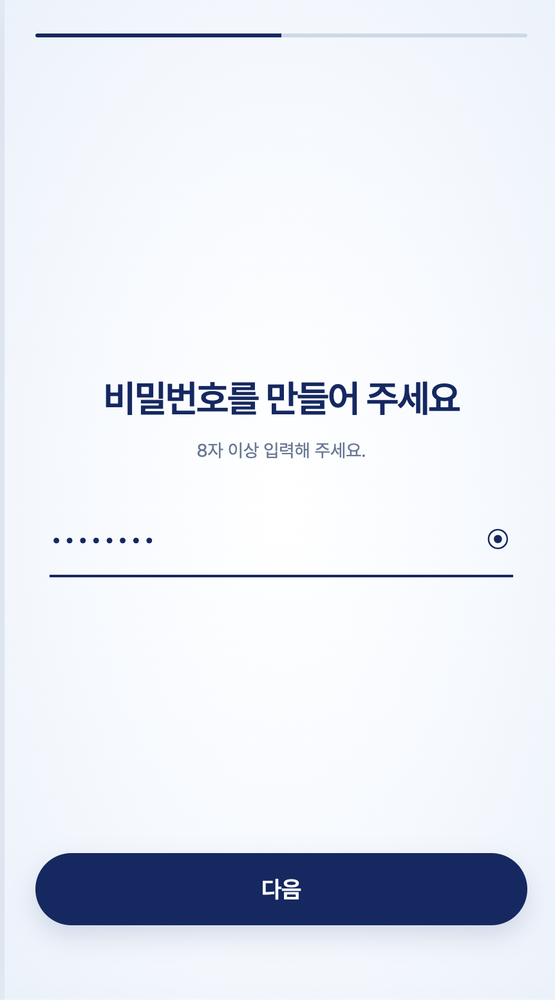<br /><sub>비밀번호 생성</sub></td>
  </tr>
  <tr>
    <td align="center">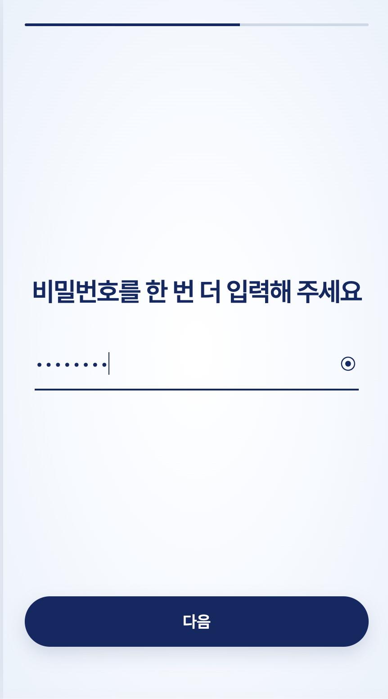<br /><sub>비밀번호 확인</sub></td>
    <td align="center">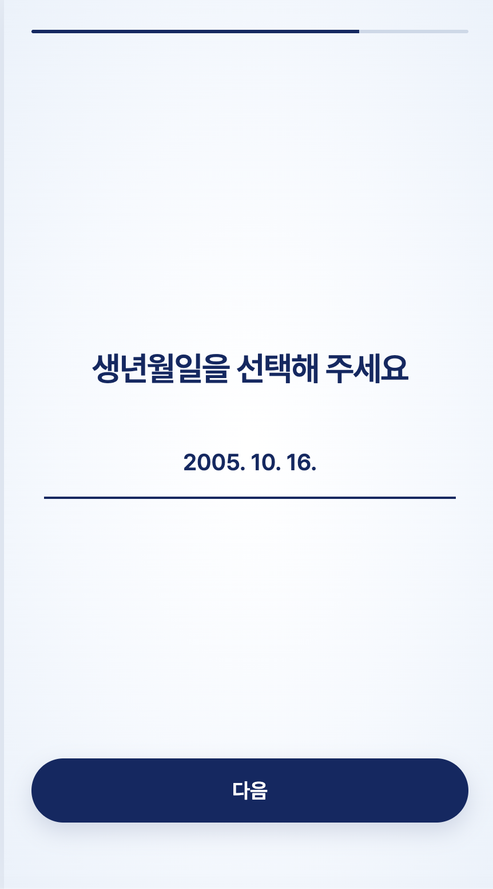<br /><sub>생년월일 선택</sub></td>
    <td align="center">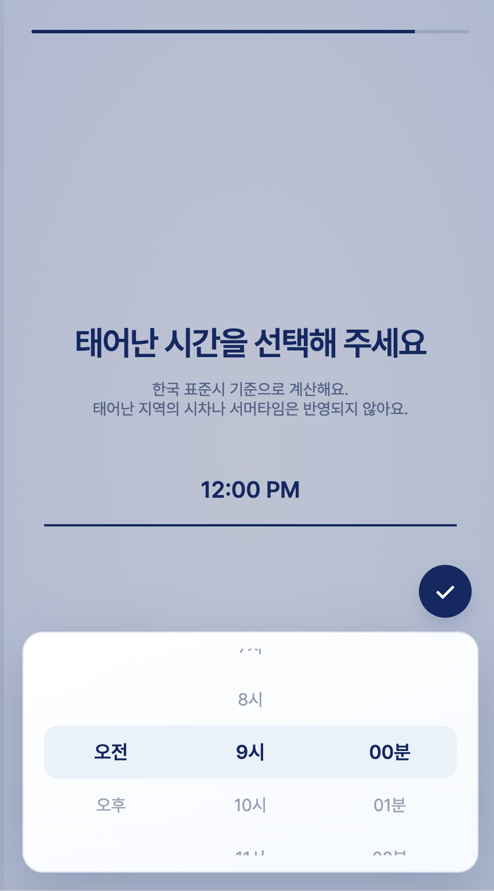<br /><sub>태어난 시각 선택</sub></td>
    <td align="center">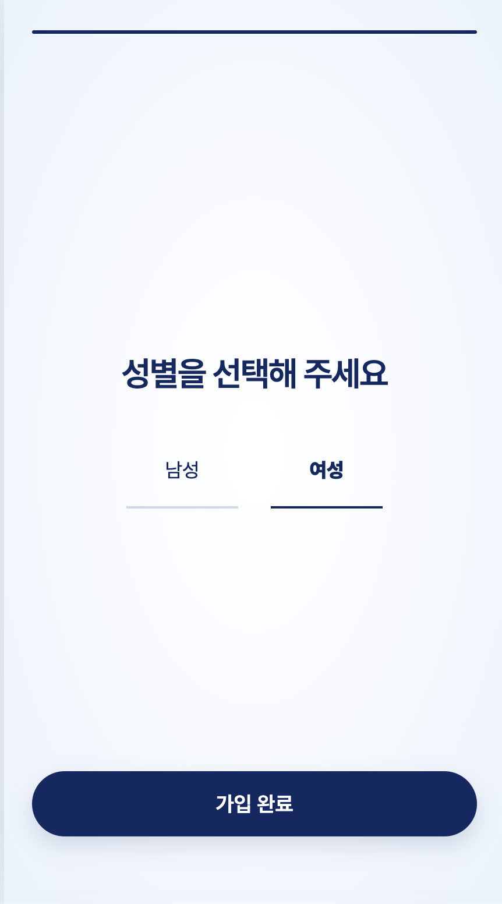<br /><sub>성별 선택 후 가입</sub></td>
  </tr>
</table>

### 2.2 메인 탐색과 프로필 관리

메인은 다섯 기능을 카드 캐러셀로 탐색하도록 구성했습니다. 사이드 메뉴에서는 전체 기능으로 바로 이동할 수 있고, 저장한 출생 정보는 프로필 화면에서 언제든 수정할 수 있습니다.

<table>
  <tr>
    <td align="center"><br /><sub>전체 기능 메뉴</sub></td>
    <td align="center">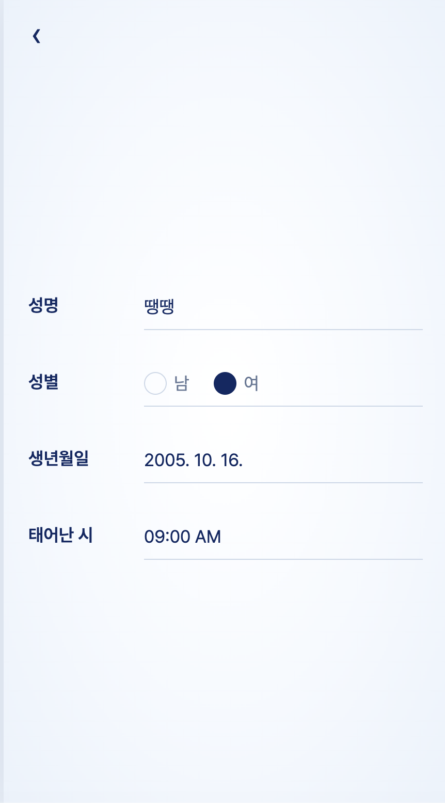<br /><sub>저장된 프로필</sub></td>
    <td align="center">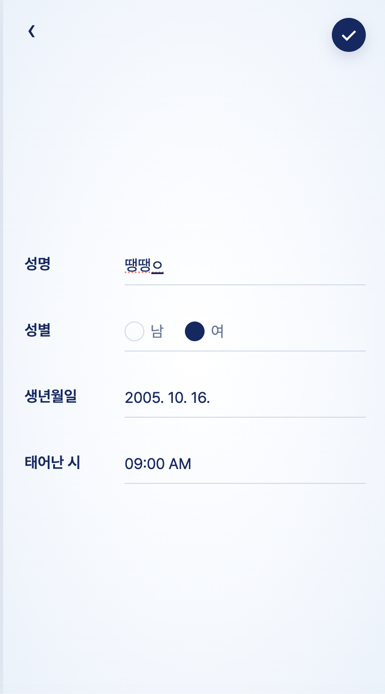<br /><sub>프로필 수정과 저장</sub></td>
  </tr>
</table>

---

## 3. 주요 기능

### 3.1 학업운 — 하루 한 번 카드 뽑기

18장 카드 중 하나를 선택하면 전체 78장 덱에서 랜덤으로 카드가 결정됩니다. 같은 날 다시 열었을 때 결과가 바뀌지 않도록 브라우저에 그날의 카드를 저장합니다. 결과는 카드의 상징을 학업 상황에 맞게 바꾼 오늘의 조언, 주의점, 실천 미션으로 보여 줍니다.

<table>
  <tr>
    <td align="center"><br /><sub>카드 섞기와 선택</sub></td>
    <td align="center"><br /><sub>선택 결과 공개</sub></td>
    <td align="center">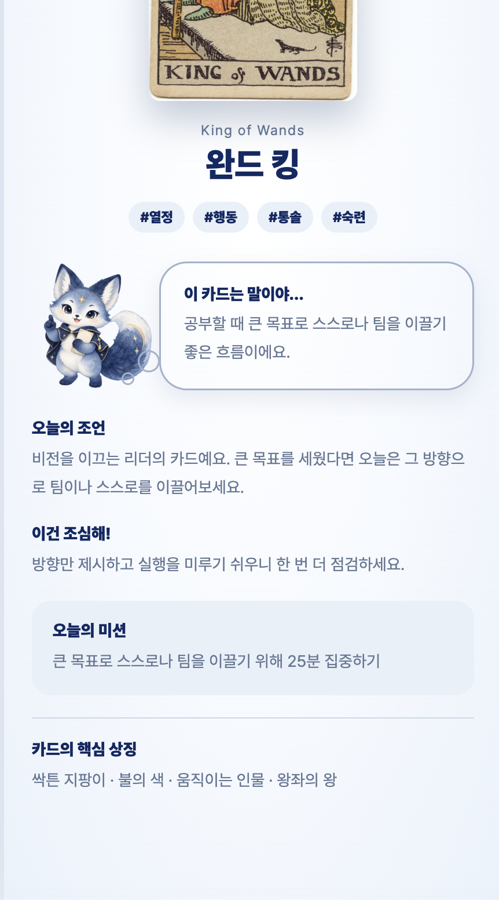<br /><sub>조언·주의점·오늘의 미션</sub></td>
  </tr>
</table>

### 3.2 학과 추천 — 사주를 전공 탐색 지표로 변환

사주의 오행과 십성 분포를 먼저 `분석·창의·소통·실행·탐구`의 5대 성향으로 바꾸고, 이를 다시 대학 학습 상황에 가까운 8대 적성으로 변환합니다.

`이론·분석 · 설계·창작 · 실험·연구 · 제작·정비 · 데이터·디지털 · 협업·소통 · 서비스·현장 · 운영·관리`

각 적성 벡터를 인하공전 33개 학과의 교육 활동 기반 프로필과 비교해 TOP 3를 선정합니다. 기본 결과는 사주 적성 100%이며, 선택형 질문 2개에 답하면 `사주 70% + 관심 분야 20% + 학습 환경 10%`로 다시 계산합니다.

<table>
  <tr>
    <td align="center"><br /><sub>학과 추천 시작</sub></td>
    <td align="center">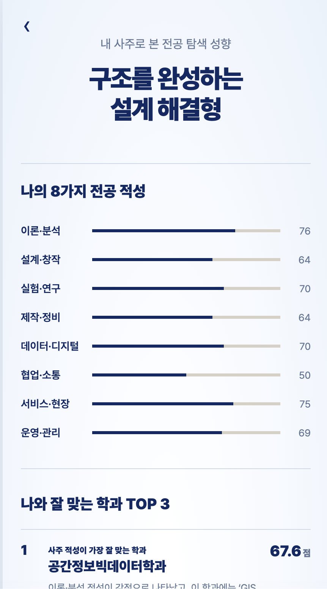<br /><sub>8대 전공 적성</sub></td>
    <td align="center">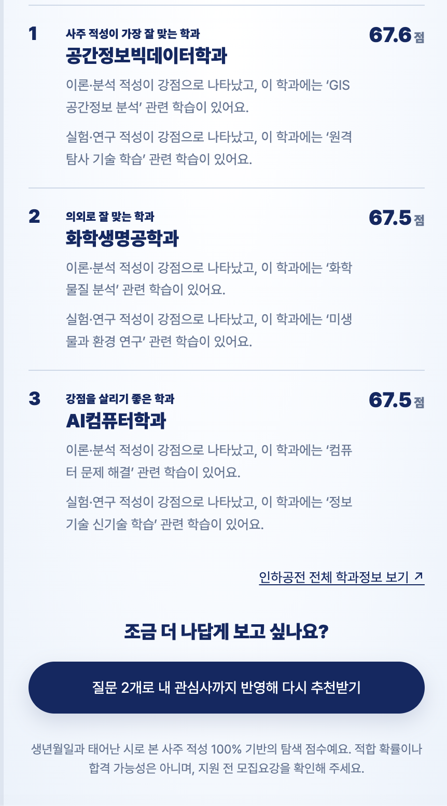<br /><sub>추천 학과와 추천 근거</sub></td>
  </tr>
</table>

추천 점수는 규칙 기반 탐색 점수입니다. 학과별 공식 페이지와 모집 구분을 결과에 함께 연결했습니다.

### 3.3 오늘의 운세 

오늘의 일진과 사용자의 원국을 비교해 재물·애정·건강·직업·관계·학업 점수를 계산합니다. 종합 점수와 1년 중 순위, 최근 7일 흐름을 시각화하고, 합·충·형·파·해처럼 점수에 영향을 준 관계와 오늘의 기운을 함께 설명합니다.

<table>
  <tr>
    <td align="center">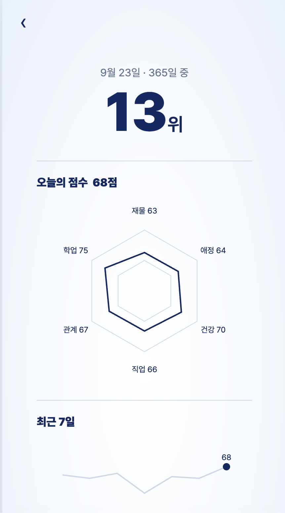<br /><sub>6개 영역·연간 순위·최근 7일</sub></td>
    <td align="center">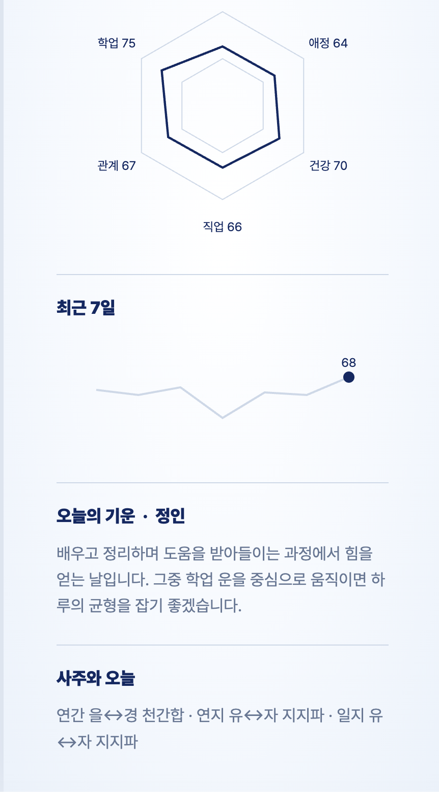<br /><sub>오늘의 기운과 사주 상호작용</sub></td>
  </tr>
</table>

### 3.4 평생 사주 — 계산 결과를 단계적으로 탐색

사주 원국과 나를 나타내는 일간, 오행 분포를 먼저 보여 주고 상세 항목은 펼쳐 보는 방식으로 구성했습니다. 십성·지장간·십이운성·공망·십이신살·길신과 주의 신살·용신·대운을 한 화면에서 탐색할 수 있습니다.

<table>
  <tr>
    <td align="center">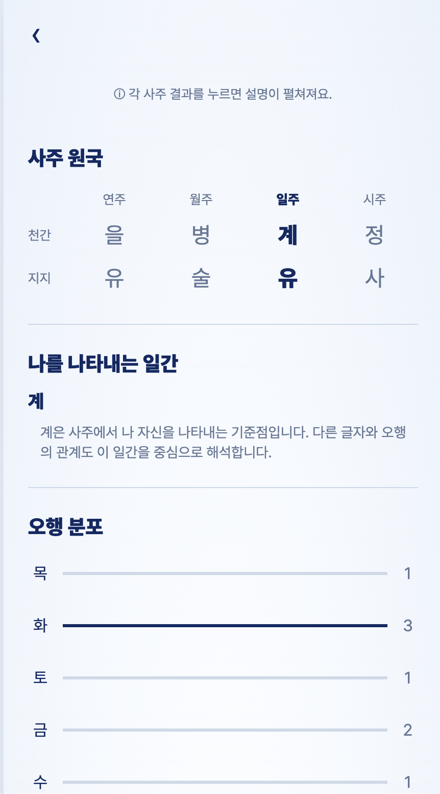<br /><sub>사주 원국·일간·오행 분포</sub></td>
    <td align="center">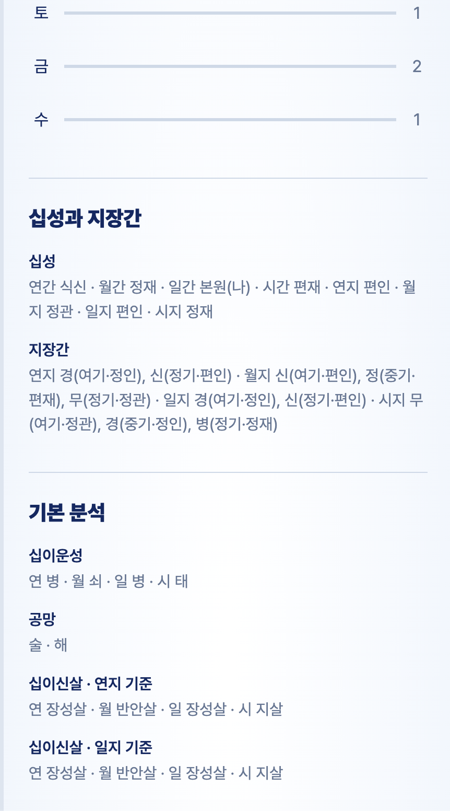<br /><sub>십성부터 대운까지 상세 분석</sub></td>
  </tr>
</table>

### 3.5 팀플 궁합 — 점수와 역할을 함께 제안

2명부터 최대 5명까지 팀원을 입력하면 각 구성원의 사주를 계산한 뒤 모든 두 사람 조합을 비교합니다. 일간 오행 관계, 일지의 합·충·해, 용신 보완, 오행 분포 보완도를 반영해 팀 점수와 팀원별 궁합을 만들고 가장 강한 오행을 기준으로 역할을 제안합니다.

<table>
  <tr>
    <td align="center">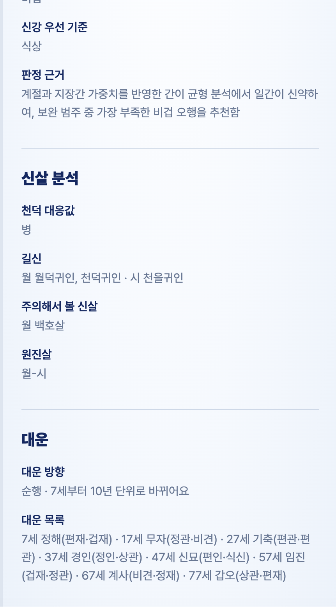<br /><sub>2~5명 팀원 입력</sub></td>
    <td align="center">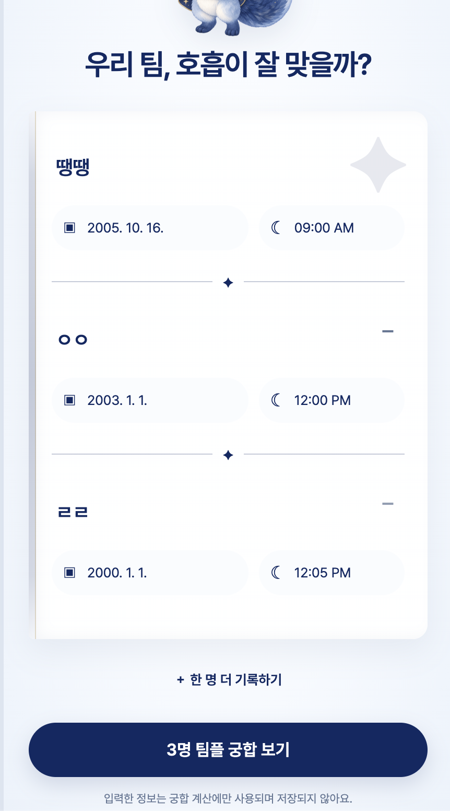<br /><sub>팀 종합 점수</sub></td>
    <td align="center">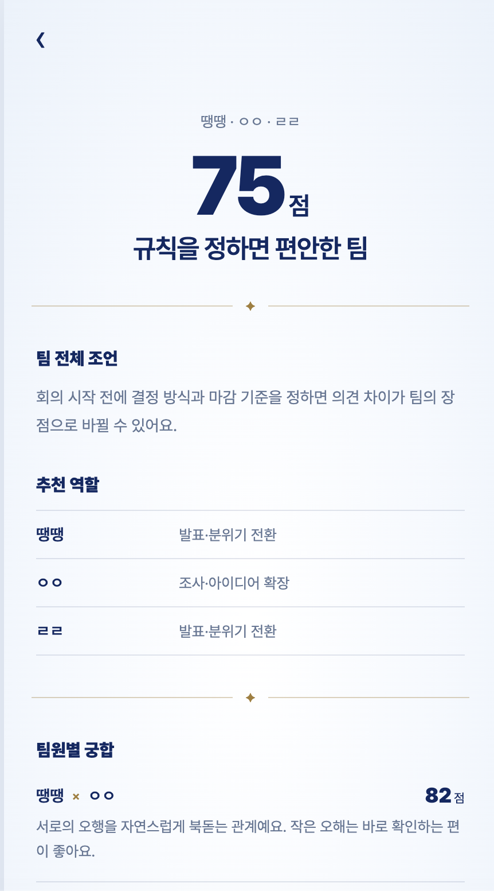<br /><sub>팀 전체 조언</sub></td>
    <td align="center">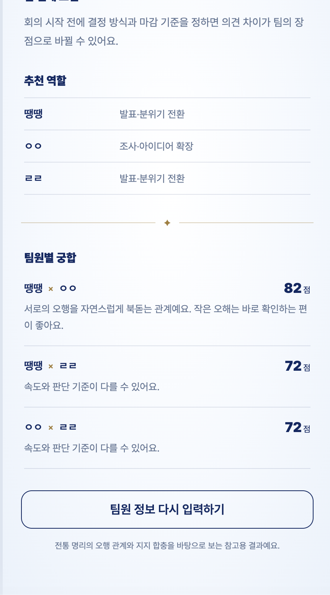<br /><sub>추천 역할·팀원별 궁합</sub></td>
  </tr>
</table>

### 3.6 운세 캘린더 — 확인한 날의 기록

오늘의 운세를 열어 본 날짜를 별도로 기록합니다. 달력에서 날짜를 선택하면 당시 종합 점수, 연간 순위와 6개 영역을 다시 확인할 수 있고, 기록이 없는 날짜는 비어 있는 상태로 구분합니다.

<table>
  <tr>
    <td align="center">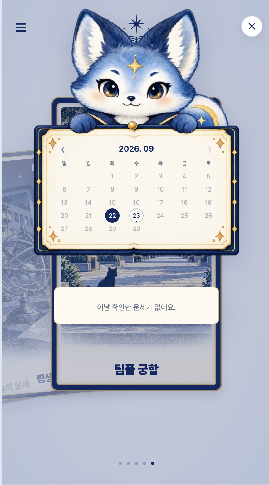<br /><sub>기록이 없는 날짜</sub></td>
    <td align="center">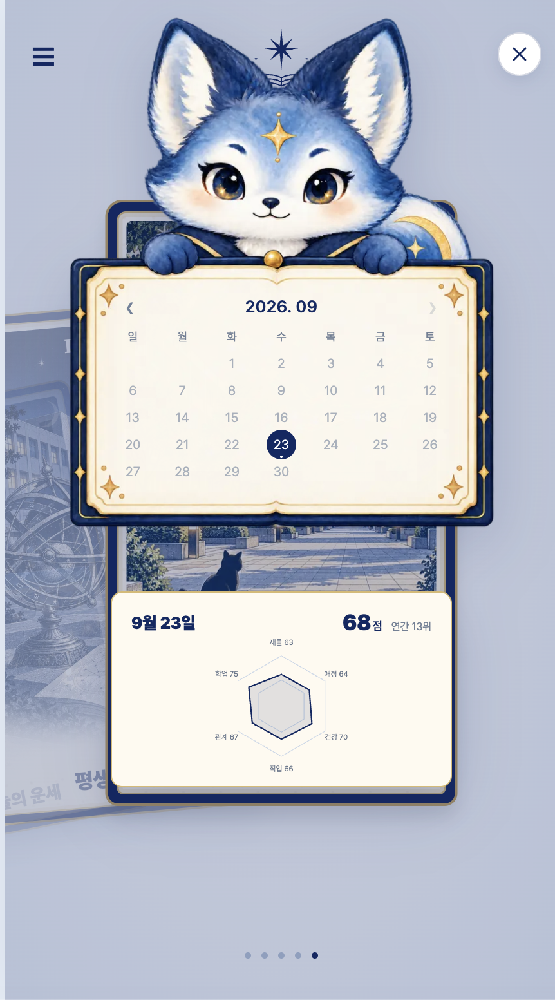<br /><sub>확인한 날짜의 운세 기록</sub></td>
  </tr>
</table>

---

## 4. 시스템 구조

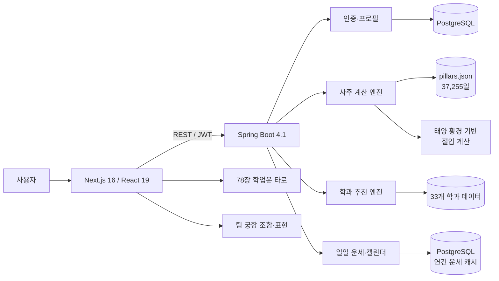
```mermaid
flowchart LR
    U[사용자] --> FE[Next.js 16 / React 19]
    FE -->|REST / JWT| API[Spring Boot 4.1]

    API --> AUTH[인증·프로필]
    API --> FORTUNE[사주 계산 엔진]
    API --> MAJOR[학과 추천 엔진]
    API --> DAILY[일일 운세·캘린더]

    FORTUNE --> DATA[(pillars.json<br/>37,255일)]
    FORTUNE --> TERM[태양 황경 기반<br/>절입 계산]
    MAJOR --> DEPT[(33개 학과 데이터)]
    DAILY --> CACHE[(PostgreSQL<br/>연간 운세 캐시)]
    AUTH --> DB[(PostgreSQL)]

    FE --> TAROT[78장 학업운 타로]
    FE --> TEAM[팀 궁합 조합·표현]
```

### 기술 스택

| 구분 | 기술 |
| --- | --- |
| Frontend | Next.js 16.3.4, React 19.2.4, TypeScript 5.9 |
| Backend | Java 21, Spring Boot 4.1, Spring Security, Spring Data JPA |
| Database | PostgreSQL, Flyway |
| Authentication | JWT Access Token 15분, Refresh Token 30일·재발급 시 회전 |
| Test | JUnit, Spring MVC/JPA/Security 통합 테스트 |

---

## 5. 핵심 계산 로직

### 5.1 사주 계산

1. `pillars.json`의 1926-01-01~2027-12-31, 총 37,255일 데이터를 양력·음력 인덱스로 메모리에 적재합니다.
2. 연주와 월주는 음력 설이나 음력 월이 아니라 태양 황경으로 구한 12절입 시각을 경계로 결정합니다.
3. 출생 시각이 23시대이면 다음 날 일주를 적용하는 야자시 기준을 사용합니다.
4. 일간을 기준으로 십성을 판별하고 지장간·오행 분포·십이운성·공망·신살을 계산합니다.
5. 지장간과 월지 가중치를 반영한 간이 강약 분석으로 용신 후보를 제안합니다.
6. 성별과 연간의 음양에 따라 대운의 순행·역행을 정하고, 절입까지의 시간을 `3일 = 1년`으로 환산합니다.

용신 결과는 조후·격국·통근·투간을 확정하는 전문 감정이 아니라 서비스 내 개인화에 사용하는 간이 오행 균형 지표입니다.

### 5.2 오늘의 운세

```text
영역별 기준점
  + 오늘의 십성이 각 영역에 주는 영향
  + 오늘 간지와 용신 오행의 일치 보너스
  + 원국과 오늘 일진의 합·충·형·파·해
  = 재물·애정·건강·직업·관계·학업 점수 (0~100)
```

6개 영역의 평균을 종합 점수로 사용하고, 같은 해 전체 날짜의 종합 점수와 비교해 연간 순위를 계산합니다. 오늘 결과는 먼저 응답하고, 나머지 연간 결과는 비동기로 생성해 PostgreSQL에 캐시합니다. 계산 방식이 바뀐 캐시는 버전 값으로 구분하며, 프로필을 수정하면 커밋 후 해당 연도의 캐시를 다시 생성합니다.

### 5.3 학과 추천

```text
오행 분포 ─┐
            ├─> 5대 성향 ─> 8대 전공 적성 ─> 33개 학과와 적합도 비교 ─> TOP 3
십성 분포 ─┘

5대 성향 = 오행 성향 35% + 십성 성향 65%
개인화 점수 = 사주 적성 70% + 관심 분야 20% + 학습 환경 10%
```

추천 학과에는 공식 학과 소개에서 정리한 활동 태그와 8대 적성 프로필을 저장했습니다. 추천 이유는 사용자의 강점 축과 학과 활동이 만나는 지점을 문장으로 생성합니다.

### 5.4 팀 궁합

팀 궁합은 각 팀원의 사주 원본을 백엔드에서 계산한 뒤 프론트엔드에서 조합합니다.

- 두 사람의 기준점은 72점입니다.
- 일간 오행의 동일·상생·상극 관계를 반영합니다.
- 일지의 합·충·해와 용신 보완 관계를 반영합니다.
- 서로 부족한 오행을 채우면 보완 점수를 더합니다.
- 모든 쌍별 점수의 평균을 팀 종합 점수로 사용합니다.
- 가장 많은 오행에 따라 기획·발표·조율·검수·조사 역할을 제안합니다.

---

## 6. API

| Method | Endpoint | 설명 | 인증 |
| --- | --- | --- | --- |
| `POST` | `/api/auth/signup` | 회원가입 | 불필요 |
| `POST` | `/api/auth/login` | 로그인과 토큰 발급 | 불필요 |
| `POST` | `/api/auth/refresh` | 액세스·리프레시 토큰 재발급 | 리프레시 토큰 |
| `POST` | `/api/auth/logout` | 리프레시 토큰 폐기 | 리프레시 토큰 |
| `GET` | `/api/auth/session` | 로그인 세션 확인 | 필요 |
| `GET/PUT` | `/api/profile` | 출생 프로필 조회·수정 | 필요 |
| `POST` | `/api/fortune/calculate` | 생년월일시 기반 사주 계산 | 불필요 |
| `POST` | `/api/fortune/major-recommendations` | 학과 추천 | 불필요 |
| `GET` | `/api/fortune/today` | 오늘의 운세 | 필요 |
| `GET` | `/api/fortune/calendar` | 월별 운세 확인 기록 | 필요 |

---

## 7. 로컬 실행

### 준비 사항

- Node.js와 Yarn
- Java 21
- PostgreSQL
- `fourpillars` 데이터베이스와 `fourpillars_app` 사용자

필요하면 다음 환경변수로 기본 DB 연결을 변경할 수 있습니다.

```bash
export FOURPILLARS_DB_URL=jdbc:postgresql://127.0.0.1:5432/fourpillars
export FOURPILLARS_DB_USERNAME=fourpillars_app
export FOURPILLARS_DB_PASSWORD=your_password
```

### 백엔드

```bash
cd backend
JAVA_HOME=/opt/homebrew/opt/openjdk@21/libexec/openjdk.jdk/Contents/Home ./mvnw spring-boot:run
```

백엔드 상태 확인: `http://127.0.0.1:8080/actuator/health`

### 프론트엔드

```bash
# 저장소 루트에서
yarn install
yarn dev
```

브라우저에서 `http://localhost:3000`을 엽니다. Next.js의 `/backend/*` 요청은 로컬 Spring Boot API로 전달됩니다.
